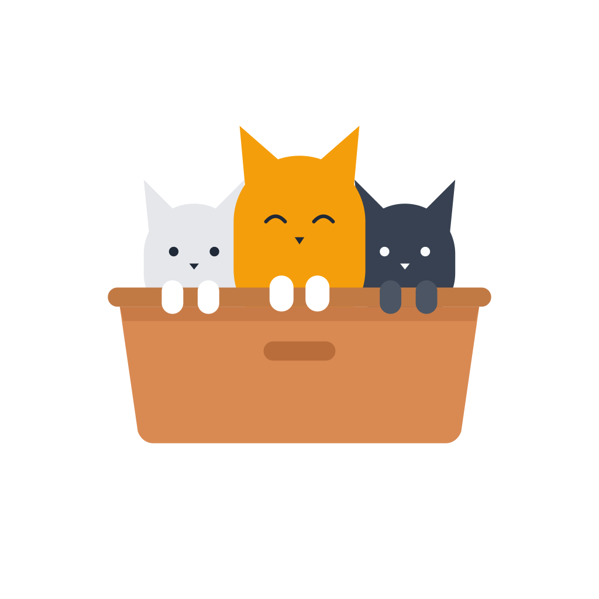
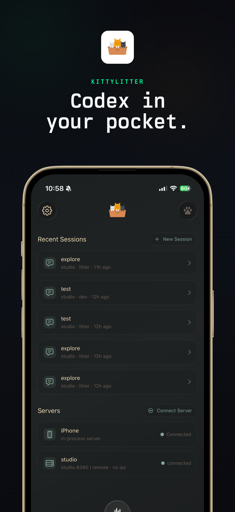
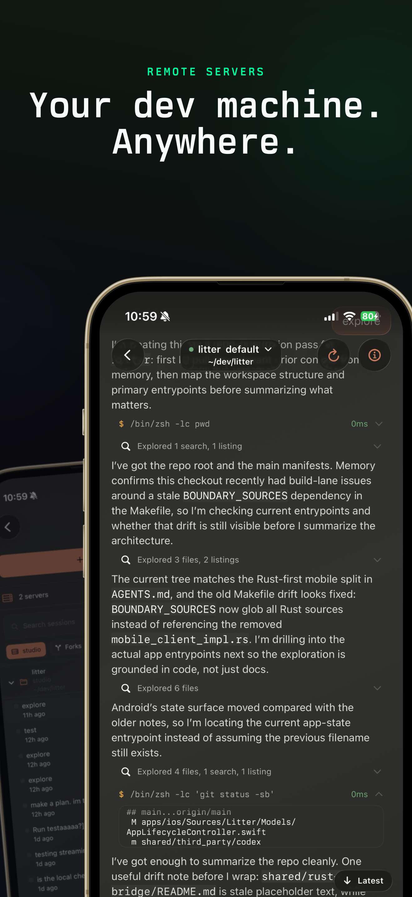
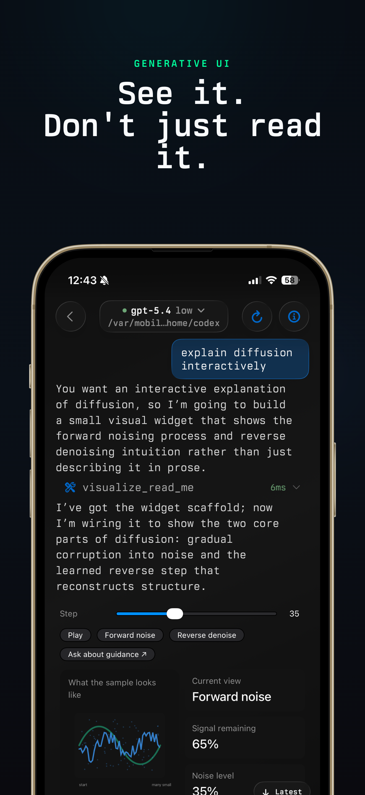
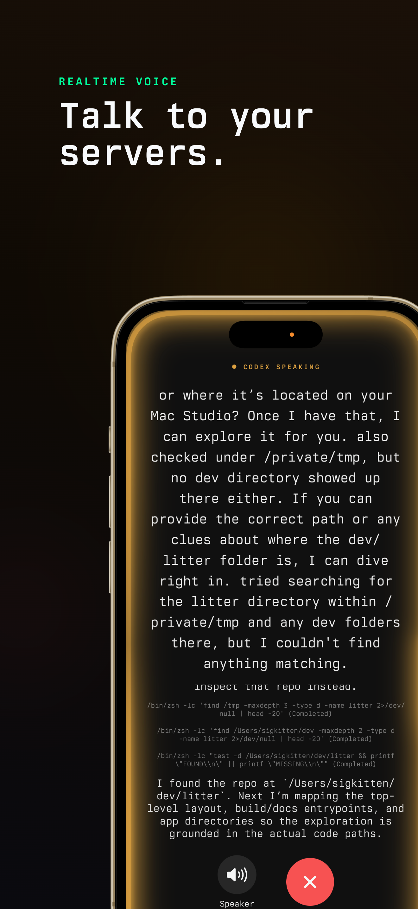

# Litter

<p align="center">
  
</p>

<p align="center">
  Native iOS Codex client with a Rust bridge, an embedded iSH runtime, remote computer connections, and an experimental Nyxian-based Swift BuildKit.
</p>

<p align="center">
  <a href="https://kittylitter.app"></a>
  &nbsp;
  <a href="https://apps.apple.com/us/app/kittylitter/id6759521788"></a>
</p>

## Current Scope

Litter is a SwiftUI iOS app that talks to Codex through `shared/rust-bridge`. It can run Codex commands inside an embedded iSH Alpine Linux fakefs, connect to Codex app servers on other computers, pair through Slingshot, and route chat through a signed-in ChatGPT account or OpenAI-compatible servers such as Ollama or LM Studio running on a computer.

iPhone-local model downloading and inference are not part of the app. Private or local models should run on a computer and be added through the AI Providers screen as an OpenAI-compatible `/v1` endpoint.

The repository also contains CI lanes for unsigned sideload IPAs, TestFlight, Mac Catalyst, and a private BuildKit asset pipeline. Public source contains the Nyxian and BuildKit integration code, but the Apple SDK payload and compiled private BuildKit frameworks are not committed.

Original creator/upstream maintainer: [Daniel Nakov / dnakov](https://github.com/dnakov). This fork is maintained by [NightVibes33](https://github.com/NightVibes33). In this repo, NightVibes, NightVibes33, NightVibes3, ZYN, and Zyn refer to the same fork maintainer, not separate contributors. Accepted upstream contributors and third-party attribution are tracked in [AUTHORS.md](AUTHORS.md) and [THIRD_PARTY_NOTICES.md](THIRD_PARTY_NOTICES.md).

## Screenshots

<p align="center">
  
  
  
  
</p>

## Repository Layout

```text
apps/ios/                  SwiftUI app. project.yml is the XcodeGen source of truth.
apps/android/              Android app, Compose UI, proot/Ghostty integration, and release lanes.
shared/rust-bridge/        Rust mobile bridge, UniFFI API, iSH/proot runtime, SSH, Slingshot, terminal, and app-server transport.
shared/third_party/codex/  Upstream Codex submodule used by the bridge.
shared/third_party/ghostty/ Pinned Ghostty renderer submodule used by the terminal work.
patches/codex/             Local Codex patches applied during sync/build.
patches/ghostty/           Litter mobile embedding patch for the Ghostty renderer.
ThirdParty/Nyxian/         Nyxian/CoreCompiler/LLVM-On-iOS source used by BuildKit.
ThirdParty/SideStore/      SideStore/AltSign/minimuxer/LocalDevVPN integration source and references.
tools/scripts/             Build, release, BuildKit asset, and verification scripts.
docs/                      Development notes, screenshots, badges, and release docs.
.github/workflows/         Unsigned IPA, BuildKit asset, mobile release, TestFlight, and Mac CI.
```

Tracked source includes Swift, Rust, Objective-C/C/C++, shell scripts, XcodeGen config, GitHub Actions workflows, and vendored source needed by the mobile runtime.

## Quick Start

On macOS, install Xcode, Rust, XcodeGen, and the expected mobile toolchains, then use the Make targets:

```bash
make ios-device-fast      # fast iOS device build
make ios-sim-fast         # fast simulator build
make android-emulator-fast # fast Android emulator build
make rust-check           # host cargo check for shared Rust crates
make rust-test            # host cargo test for shared Rust crates
```

`apps/ios/project.yml` drives the checked-in Xcode project:

```bash
make xcgen
```

For a newly paired Apple Watch, run `make watch-register` once after pairing in Xcode. It registers the watch UDID and refreshes the provisioning profile so CLI installs can deploy `LitterWatch`.

The upstream sync through `dnakov/litter@3fd94228` brings the latest original terminal, Ghostty, watch, discovery-pairing, composer-selection, trusted-publishing, and crash-path fixes into the fork while keeping the fork's BuildKit, KittyStore, AltSign, and minimuxer work intact.

The iOS app target deploys to iOS 18.0. The unsigned IPA workflow runs on `macos-26` with Xcode 26.3. The private BuildKit asset workflow defaults to Xcode 26.4 and Swift `swift-6.3.1-RELEASE`.

## Architecture

The SwiftUI app owns the native interface: home, conversations, settings, file workspace, terminal panel, account and Keychain flows, PiP, CarPlay, Watch surfaces, and BuildKit controls. The Rust bridge owns Codex app-server communication, session hydration, Slingshot pairing, SSH bridge behavior, remote path handling, saved apps/widgets, permission state, iSH command execution, and the UniFFI surface consumed by Swift.

The local runtime is not the iOS host shell. Commands run inside an embedded persistent iSH Alpine Linux fakefs. The default home is `/root`; Litter creates `/root/litter`, `/root/.litter/builds`, and `/usr/local/bin`; app Documents can be bridged through `/mnt/apps`; and Codex home is bridged to `/root/.codex` so installed skills are visible to the app runtime.

Before exposing local shell tools, Litter runs a native preflight command. If simple commands such as `true`, `pwd`, or `ls` fail with bootstrap errors, debug the iSH runtime bridge first. PATH, Swift, and BuildKit checks come after the fakefs is bootstrapped.

## Main iOS Features

- Home dashboard for local and remote sessions, active turn state, recent activity, branch/fork actions, rename/delete/hide actions, goal banners, and connection status.
- Conversation timeline with markdown, tool cards, command output display preferences, image generation cards, selectable messages, edit/fork actions, streaming rendering, and dynamic widget rendering.
- Discovery and connection flows for the local runtime, manual app-server URLs, SSH bootstrapping, LAN or remote servers, and Slingshot connected computers.
- Settings for appearance, fonts, conversation display, local terminal, experimental features, AI providers, diagnostics bundles, account/API key/base URL, connected servers, updates, and BuildKit developer controls.
- KittyStore, a KittyLitter-branded SideStore/AltStore-compatible store surface. It loads multiple SideStore/AltStore source URLs, shows source news, browses apps across those sources, opens direct install links, and keeps a Feather-style signing workspace for imported or downloaded IPAs.
- Picture-in-Picture streaming cards through `AVPictureInPictureController` with a sample-buffer SwiftUI renderer.
- CarPlay voice scene support and experimental Apple Watch projection/complication targets.

## Files And Terminal

The Files button opens the iSH workspace rooted at `/root`. It uses the same fakefs command bridge used by Codex tool calls and the terminal panel, so file actions operate on the same filesystem the bot sees.

The file workspace includes list/grid views, breadcrumbs, search, sorting, filters, hidden-file toggles, quick locations, favorites, recents, inspectors, archive/build-artifact detection, and bot-context path copying. It also exposes file operations for creating, renaming, moving, duplicating, deleting, making executable, sharing, compressing, extracting, importing from iOS Files, and editing text/code files.

The terminal lives in Settings under `Local Tools -> Terminal`. `Open Terminal Here` from the file browser sets the starting directory for that same terminal. It is a command panel backed by the iSH command bridge: prompt, cwd tracking, history, shortcut keys, copy output, clear, and command execution all share the local fakefs runtime. It is not a separate iOS host shell.

BuildKit shortcuts in the file workspace and BuildKit settings call the same fakefs commands, including Swift check, Swift build, IPA build, build status, fakefs doctor, and `LitterBuild.json` creation.

## Appearance And Streaming

Appearance settings include system/light/dark mode selection, app-wide conversation font scaling, live preview, and separate light/dark theme pickers loaded from app resources.

Conversation wallpapers are scoped per thread or per server. Supported sources include built-in generated presets, light/dark app themes, solid colors, images from Photos, videos from Photos, and video URLs. Custom image preview uses a fitted renderer instead of blindly zooming the image to fill the screen.

Built-in background presets in `WallpaperManager` are Aurora, Terminal Grid, Blueprint, Midnight Neon, Ocean Glass, Sakura, Carbon Mesh, Solar Flare, Paper, and Forest.

Typing effects are persisted with the wallpaper scope and are driven by `StreamingEffectKind` plus HairballUI `StreamingTextEffect` implementations. Current options include Fade Edge, Sparkle, Glow Cursor, Wave, Scale Pop, Rainbow, Fire Trail, Explosion, Nyan Cat, Matrix Decode, Phosphor CRT, Shockwave, Typewriter, Terminal Scan, Soft Blur, Neon Pulse, Ghost Trail, Pixel Decode, Ink Spread, Slide Up, Glitch, and Focus Beam.

## AI Providers

Supported routes are:

- ChatGPT Account: the signed-in local Codex/ChatGPT route.
- Computer Bridge: a selected Mac, Windows, or Linux Codex app-server bridge.
- OpenAI-compatible server profiles: custom `/v1` endpoints for services such as Ollama or LM Studio running on another machine.

Legacy on-device AI state is cleaned up on load. Old local provider records are skipped, old local routing preferences fall back to automatic, old local model files are purged from the app documents directory, and only hosted routes are shown in the picker.

## Thread Goals

The Rust bridge advertises `features.goals` and exposes UniFFI methods for getting, setting, clearing, and hydrating thread goals. iOS stores hydrated goals in app state and renders goal status, objective, and usage in the home dashboard and PiP views. Goal persistence depends on the connected Codex server state database for that thread.

## Swift BuildKit

BuildKit is the experimental on-device Swift/iOS build path. Litter vendors Nyxian source, verifies it with `tools/scripts/verify-nyxian-source-import.sh`, and layers a Litter-specific native bridge on top. The public repo has source and reproducible scripts. Full Swift/iOS compilation still needs a private `LitterBuildKitAssets.zip` because Apple SDK files and compiled private frameworks are not committed.

If `litter-buildkit-install-assets` reports `assets-missing` with a ZIP extraction error, replace `Documents/LitterBuildKitAssets.zip` or `Documents/Inbox/LitterBuildKitAssets.zip` with a known-good private asset pack and rerun `litter-buildkit-install-assets --timeout 300`. Litter records failed automatic installs by ZIP fingerprint so the app does not keep blocking the BuildKit request pump on the same corrupt asset; an explicit install command still retries and returns the real extraction error.

The private asset pack must include:

- `Toolchains/Nyxian/CoreCompiler.framework`
- `Toolchains/Nyxian/CoreCompilerSupportLibs`
- `Toolchains/Nyxian/SwiftResourceDir`
- `Toolchains/Nyxian/LitterBuildKitNative.framework`
- `SDK/iPhoneOS<version>.sdk`
- optional `Toolchains/Nyxian/bin/litter-buildkit-runner`
- `manifest.json` with required paths and SHA256 entries

Important packaging rule: changing `ThirdParty/Nyxian/LitterBuildKitNative/**` does not change installed app behavior by itself. The app loads `LitterBuildKitNative.framework` from `LitterBuildKitAssets.zip`. After native bridge changes, rebuild and upload the private asset pack, update `LITTER_BUILDKIT_ASSET_URL` and `LITTER_BUILDKIT_ASSET_SHA256`, then build the IPA against that new asset.

Nyxian run/install mode needs more than compiler files. The installed app also needs the Apple ID and signing state used by the original Nyxian flow: an Apple ID login saved in Keychain, a SideStore-compatible Anisette server, the matching `.p12` signing identity, and the embedded provisioning profile from the signed Litter install.

KittyStore validates imported signing material before it is treated as usable. A bad `.p12` password, missing private key, untrusted certificate, or revoked certificate keeps Nyxian run/install blocked and shows the failure in status instead of silently accepting broken credentials. The Feather-style signing workspace validates per-app provisioning profiles for parse errors, expiration, missing developer certificates, bundle ID mismatch, and profile/certificate mismatch before certificate signing starts. BuildKit Settings reports this state as diagnostics instead of owning duplicate Apple ID or certificate forms.

Litter is open source, but it is not MIT licensed. The project is licensed under the GNU General Public License version 3 with an additional permission under GPLv3 section 7 for Apple App Store and Google Play distribution. See [LICENSE](LICENSE). Third-party source imports and submodules keep their own licenses; see [THIRD_PARTY_NOTICES.md](THIRD_PARTY_NOTICES.md).

The Anisette picker can load SideStore's public server list from `https://servers.sidestore.io/servers.json`, falls back to known SideStore-compatible servers, and allows a custom server URL. Anisette only supplies Apple authentication metadata. It does not install apps by itself.

Full on-device install/refresh needs SideStore-style local transport. KittyStore can launch the real LocalDevVPN app through `localdevvpn://`, then the linked SideStore minimuxer bridge checks whether the tunnel transport is ready. Swift compilation, unsigned IPA packaging, and save-only signing can still work without LocalDevVPN, but direct install/refresh/remove/list operations stay blocked until LocalDevVPN is enabled and a pairing file is imported.

Canonical fakefs commands installed into `/usr/local/bin` include:

```text
litter-buildkit
litter-nyxian-status
litter-buildkit-install-assets
litter-fs-doctor
litter-env-report
litter-dev-bootstrap
litter-swift-check
litter-swift-selftest
litter-swiftc
litter-swift-build
litter-swift-test
litter-ipa-build
litter-ipa-package
litter-clang
litter-ld
litter-build-status
litter-build-cancel
```

Compatibility shims are installed for common bot expectations:

```text
swift swiftc clang clang++ cc c++ ld ld64 xcodebuild xcrun plutil code
ar llvm-ar ranlib llvm-ranlib nm llvm-nm objdump llvm-objdump strip strings lipo
```

`litter-*` commands are the supported API. The compatibility shims cover the iOS-only cases Litter can run. BuildKit v1 is not desktop Xcode: SwiftPM package resolution, simulator workflows, Interface Builder, previews, App Store upload flows, Apple Developer portal management, and macOS toolchains are outside scope.

Useful in-app checks:

```bash
litter-fs-doctor
litter-build-status
litter-nyxian-status
litter-swift-selftest
printf 'print("Swift is running on device")\n' > /root/hello.swift
litter-swift-check /root/hello.swift
swiftc /root/hello.swift -o /root/hello
```

## Private BuildKit Asset Flow

`.github/workflows/buildkit-assets.yml` builds or reuses the private BuildKit asset pack on `macos-26`, verifies it, and can upload it to the private asset release repo. Defaults are:

- owner: `NightVibes33`
- repo: `litter-buildkit-assets`
- tag: `buildkit-ios26.4-v1`
- asset name pattern: `LitterBuildKitAssets-<run>-<attempt>.zip`

Use this flow when BuildKit source or private framework behavior changes:

1. Run `Build Private BuildKit Assets` on the branch containing the source fix.
2. Use `force_rebuild=true` when the native framework or Swift/LLVM payload must be rebuilt.
3. Set `use_existing_private_release=false` when you need to prove the old private release asset is not being reused.
4. Let the workflow upload a verified `LitterBuildKitAssets.zip` and update the unsigned IPA asset secrets.
5. Run or let it dispatch `.github/workflows/ios-unsigned-ipa.yml` on the same branch.
6. Install the new IPA and run `litter-swift-selftest` inside Litter.

Normal public IPAs keep the private compiler payload external for launch safety. The app can still download/install user-owned BuildKit assets from BuildKit settings.

## Unsigned IPA And AltStore Source

`.github/workflows/ios-unsigned-ipa.yml` builds a SideStore/AltStore-style unsigned IPA on `macos-26` with Xcode 26.3. It produces `build/unsigned-ipa/Litter-${VERSION}.ipa`, a SHA256 file, build metadata, release notes, `litter-update.json`, and `litter-altstore-source.json`.

Manual build modes are:

- `fast-device`: normal fast device lane. Reuses generated Rust assets when possible, strips stale signatures, removes embedded extensions, and keeps private BuildKit compiler payload external.
- `release-device`: full device lane. Rebuilds Rust instead of using the fast-device shortcut.
- `nyxian-private`: private/manual lane. Embeds verified private BuildKit assets and keeps `PlugIns/LiveProcess.appex`, the NSExtension required by original Nyxian/emexDE. This is not the default public IPA lane.

Every successful IPA build creates or updates a versioned GitHub release named `litter-v${VERSION}` and uploads the IPA, checksum, metadata, update JSON, source JSON, and release notes. The stable `app-source` release is also updated with `litter-altstore-source.json`, `litter-update.json`, and the source icon.

The in-app updater and KittyStore BuildKit commands read their app-source repository from the `LITTER_RELEASE_OWNER`, `LITTER_RELEASE_REPO`, `LITTER_RELEASE_MANIFEST_ASSET_NAME`, `LITTER_RELEASE_SOURCE_ASSET_NAME`, `LITTER_RELEASE_STABLE_TAG`, and `LITTER_RELEASE_TAG_PREFIX` build settings. The default remains `NightVibes33/litter`, but forks and rebranded builds can point the app at their own release/source repo without editing Swift code. Inside an installed build, bots can use `litter-kittystore-config --repo owner/repo` to persist the same source override at runtime, or `litter-kittystore-config --reset` to return to the compiled defaults.

The AltStore/SideStore source is version-history first. Every successful versioned IPA release should remain installable through the app entry `versions` array with its own download URL, SHA-256 checksum, version date, size, minimum iOS version, and build version. Historical IPA downloads are also emitted as source `news` cards with direct IPA URLs. `tools/scripts/verify-altstore-source.py` runs before publish and fails the workflow if a version entry is only history text, lacks a direct IPA URL, lacks a checksum, duplicates another version/build, or is missing its matching news download card. Do not replace the source with only the latest build.

The in-app KittyStore tab hosts the real SideStore five-tab surface: News, Sources, Browse, My Apps, and Settings. News is a store feed, Sources owns SideStore/AltStore source lists, Browse aggregates apps from loaded sources instead of being tied to Litter, My Apps is reserved for installed-device actions through minimuxer, and SideStore Settings owns the Apple ID sign-in, 2FA prompt, Anisette, and account/team flow. Feather-style signing lives beside it in Settings > Signing: IPA customization, certificate/provisioning selection, pairing import, LocalDevVPN launch/status, advanced Modify rows, Entitlements, Tweaks, Properties, and Start Signing.

Settings > Signing does not duplicate SideStore's login UI. It reads the saved SideStore Apple ID state and owns the Feather-side inputs: `.p12` certificate import, certificate password validation, provisioning-profile import, pairing-file import, LocalDevVPN launch/status, and Feather signing options. Apple ID signing requires the account already signed in through SideStore plus a pairing file; certificate signing requires a validated `.p12` plus a matching `.mobileprovision` or embedded provisioning profile. Any on-device install, refresh, remove, or installed-app listing also requires LocalDevVPN to be enabled and the pairing file to be present. Pairing files are saved to both SideStore's `ALTPairingFile.mobiledevicepairing` document path and Feather's `pairingFile.plist` path, then staged into fakefs for bots and BuildKit. BuildKit Settings is intentionally read-only for this state now, so SideStore account transport and Feather signing options are not duplicated.

KittyStore stages those inputs into the native BuildKit driver and uses the vendored Feather/Zsign signing engine when the private BuildKit assets are rebuilt with `LITTER_BUILDKIT_ENABLE_KITTYSTORE_SIGNER=1`. The native signer supports default, force, and ad-hoc signing modes, dylib injection, dylib load-command removal, app-relative file removal, framework/plugin copying, entitlement edits, Feather-style Info.plist properties such as app appearance, minimum iOS version, file sharing, ProMotion, Game Mode, iPad fullscreen, URL-scheme removal, and tweak payload collection from dylibs, folders, zip files, and `.deb` packages that contain `data.tar` or `data.tar.gz`.

The repo now keeps full source snapshots for SideStore (`ThirdParty/SideStore/Source`), Feather (`ThirdParty/Feather/Source`), and LocalDevVPN (`ThirdParty/SideStore/LocalDevVPN-Source`) at the exact upstream commits recorded in `ThirdParty/UPSTREAMS.md`. SideStore and Feather submodules are populated inside those source snapshots too, including SideStore AltSign, minimuxer, em_proxy, apps-v2, Roxas, MarkdownAttributedString, libimobiledevice, libplist, libusbmuxd, libimobiledevice-glue, plus Feather Zsign and IDeviceKitten. The iOS app target also embeds those full source folders as IPA bundle resources, so the shipped app carries the upstream SideStore, Feather, and LocalDevVPN source snapshots instead of only small reference files. Smaller app-reference snapshots remain in `ThirdParty/SideStore/AppReference` and `ThirdParty/Feather/AppReference` for verifier-friendly layout checks. The iOS IPA workflow also builds the vendored SideStore `minimuxer` Rust bridge through `tools/scripts/build-sidestore-minimuxer.sh`, links it into Litter with `KITTYSTORE_MINIMUXER_LINKED`, and treats the real LocalDevVPN app/tunnel as the required transport for SideStore-style on-device install/refresh/remove/list operations. Litter does not claim ownership of SideStore, Feather, or their supporting tools; SideStore, AltStore, Feather, LocalDevVPN, minimuxer, em_proxy, Jitterbug, and Zsign are credited in `THIRD_PARTY_NOTICES.md`.

Bots get a matching fakefs command surface so they do not have to scrape UI state: `litter-kittystore-status`, `litter-kittystore-config`, `litter-kittystore-source`, `litter-kittystore-versions`, `litter-kittystore-validate-profile`, `litter-kittystore-plan`, `litter-kittystore-sign`, `litter-kittystore-install`, `litter-kittystore-refresh`, `litter-kittystore-remove`, and `litter-kittystore-installed`. Source config, source, version, status, profile validation, and plan commands return JSON or write JSON to `/root`; `litter-kittystore-sign` routes through native BuildKit and publishes the signed IPA back into fakefs when the private assets include the Feather/Zsign signer. Install/refresh/remove/installed-app browsing run the linked SideStore minimuxer bridge with a signed IPA or bundle ID, imported pairing file, optional provisioning profile, and LocalDevVPN connected; builds that do not include the bridge return `sidestore-minimuxer-not-linked` instead of pretending install is available.

All IPAs from this workflow are unsigned. They must be signed by SideStore, AltStore, Feather, or another signing tool before installation.

## Local Runtime Notes

- Local commands run inside iSH Alpine Linux, not the iOS host filesystem.
- The embedded Codex server, terminal, and command bridge wait for iSH readiness before accepting fakefs commands. If a restored session hands Rust an iOS sandbox path, Litter maps the command cwd back to `/root` before dispatching into iSH.
- The fakefs can see `/root`, `/tmp`, `/usr/local/bin`, `/root/.codex`, `/root/litter`, and app-provided mounts such as `/mnt/apps`.
- The fakefs cannot directly see arbitrary iOS sandbox paths such as `/private/var/mobile/...`; Litter stages native BuildKit files through app storage when native code must read them.
- `litter-dev-bootstrap` repairs expected fakefs utilities where possible. Some tools may still require Alpine packages.
- Shell failures with exit `-6` mean the iSH runtime was not ready or not bootstrapped. Start debugging at runtime/session initialization before looking at PATH, Swift, or BuildKit.
- PTY or streaming command errors usually mean the command RPC path and client process id handling need attention, not that the fakefs files disappeared.

## Make Targets

| Target | Description |
|---|---|
| `make ios-device-fast` | Fast iOS device build using the raw device staticlib lane. |
| `make ios-sim-fast` | Fast simulator build. |
| `make ios` | Full iOS package lane. |
| `make android-emulator-fast` | Fast Android emulator build. |
| `make android-alpine-fs` | Prepare the bundled Android Alpine fakefs. |
| `make proot-android` | Build Android proot executable artifacts. |
| `make ghostty-ios` | Build pinned Ghostty iOS renderer artifacts. |
| `make ghostty-android` | Build pinned Ghostty Android renderer artifacts. |
| `make sync-ghostty` | Sync the pinned Ghostty submodule while preserving the Litter mobile patch. |
| `make watch-register` | Register a newly paired Apple Watch for CLI install flows. |
| `make rust-check` | Host `cargo check` for shared Rust crates. |
| `make rust-test` | Host `cargo test` for shared Rust crates. |
| `make bindings` | Regenerate UniFFI Swift/Kotlin bindings. |
| `make xcgen` | Regenerate `Litter.xcodeproj` from `apps/ios/project.yml`. |
| `make alpine-fs` | Prepare the bundled iOS Alpine fakefs. |
| `make nyxian-vendor` | Refresh the focused upstream Nyxian/LLVM-On-iOS BuildKit source import while preserving Litter's bridge. |
| `make nyxian-source-verify` | Verify the committed Nyxian source import. |
| `make nyxian-buildkit-assets` | Build/package private BuildKit assets on macOS. |
| `make nyxian-buildkit-assets-verify` | Validate a BuildKit asset ZIP or folder. |
| `make sidestore-minimuxer` | Build the SideStore minimuxer bridge used by KittyStore install/refresh work. |
| `make clean` | Remove build artifacts. |

## Contributors

Litter began in Daniel Nakov's original upstream repository, `dnakov/litter`, and this fork continues that work under `NightVibes33/litter`. Full evidence-backed credits are maintained in [CONTRIBUTORS.md](CONTRIBUTORS.md), including upstream PRs accepted into Daniel's original repo, direct upstream commit authors, and fork-only contributors.

| Contributor | Main credited work |
|---|---|
| Daniel Nakov (`dnakov`) | Original creator/upstream maintainer; iOS and Android app architecture, Rust/Codex bridge, SSH/local runtime, iSH/Alpine work, terminal/Ghostty/proot work, watch features, mobile UI, releases, and `kittylitter`/Alleycat. |
| NightVibes33 | Fork maintainer; BuildKit asset CI/downloads, focused Nyxian import work, BuildKit IPA wiring, local model workflow polish, model import/download UX, file workspace fixes, and distribution repo maintenance. |
| Zyn | Unsigned IPA path, iOS skills bridge, AI provider/local model foundation, fakefs file workspace, native llama/TurboQuant work, local agent workspace, main-chat local model routing, and on-device Swift BuildKit integration. |
| Codex | AI-assisted implementation commits for local model tooling, BuildKit hardening, diagnostics, local file browser/runtime UX, CI, xcodebuild compatibility, and Swift toolchain support. |
| Maky (`makyinmars`) | Android/iOS session UX, composer/session cleanup, iOS Codex RPC bridge coverage, workspace/sidebar UX, skills/edit/rename/fork flows, tool-calling/picker UX, agent identity/collaboration flows, remote-host agent logos, iOS 18 support, search themes, server pill polish, SSH credential entry, theme mode, and AMP support. |
| D-DRUMROLL / Dixith-dev (`Dixith-dev`) | Android keyboard fixes, OpenCode mobile shell support, Android home/discovery/settings polish, Settings popover title alignment, dropdown positioning, and session deletion fixes. |
| Kaynan Sampaio de Camargo (`kaynansc`) | Editable saved server connections, Android SSH credential prompt parity, reconnect/edit sheet behavior, Input Required modal dismissal, OpenAI base URL setting, thread-scoped prompts/rate limits, and runtime-channel response routing. |
| Franklin | iOS/Android file search and commands, Android picker fixes, identifier/signing cleanup, session search, fonts/UX, model-list exposure, iOS exec hook work, iOS 18 support work, search themes, and iOS CI/CD fixes. |
| sigkitten | Mobile IPC/runtime work, session loading, transcript/thread reuse, permissions, native math parsing, iOS tests, Android runtime/UI fixes, generative UI Rust migration, Rust bridge cleanup, signing/provisioning, reconnect/notification behavior, and pets overlay. |
| tabrobotics | Android OpenCode/mobile shell work, bundled Codex server and Node proxy support, discovery/local bridge fixes, CI archive fallback, Gradle/lint fixes, Android image upload fixes, and input/model selector polish. |
| eagle.one / onegaop | Folder grouping for sessions in the sidebar plus related screenshot/homepage documentation. |
| kkellyoffical | Android conversation text selection, message selection preservation, markdown callback stabilization, user bubble styling restoration, and Android JVM test stabilization. |
| Coy Geek (`coygeek`) | iOS transcript display controls and UI test coverage. |
| Niklas Sheth | iOS composer editing fix that avoids forcing selection while editing text. |
| researchoor | Live Activity timer cleanup and completed-session idle indicator. |
| Sina Rabiei (`nssina`) | Mac SSH setup documentation for exposing Codex sessions in Litter. |
| Paul Pincente (`pincente`) | Android large-screen discovery modal and TV focus navigation improvements. |
| frixa / frixaco | SSH bootstrap compatibility for Macs using Fish as the default shell. |
| ryanchen01 | Expanded resolver SSH probe behavior. |
| Jason Penilla (`jpenilla`) | SSH detection for Codex installed through Bun. |
| Thomas Zarebczan (`tzarebczan`) | Windows npm publishing support for `kittylitter`. |
| shuv (`shuv1337`) | iOS theme JSON decoding fixes for null/non-string values and `#RRGGBBAA` colors. |
| zulfaza | `~/.opencode/bin` PATH probing in SSH profile initialization. |
| Benjamin Western | Pi over Alleycat transport baseline improvements. |
| sliced-paraiba | POSIX command portability using `/usr/bin/env`. |

## Credits And License

Litter is a fork of [dnakov/litter](https://github.com/dnakov/litter). This fork is maintained by NightVibes33 / ZYN / Zyn, which are the same maintainer identity for this fork, and includes additional iOS sideloading, update-source, local runtime, BuildKit, and UI work.

The sideloading and on-device install/refresh work also credits the wider ecosystem it builds around: SideStore, AltStore, LocalDevVPN, minimuxer, em_proxy, Jitterbug, and their maintainers/contributors. See [THIRD_PARTY_NOTICES.md](THIRD_PARTY_NOTICES.md) for the current attribution list.

Litter is not MIT licensed. The project uses GPLv3 with an additional GPLv3 section 7 permission for Apple App Store and iOS distribution. Vendored Nyxian/emexDE source is AGPL-3.0-or-later, OpenAI Codex source is Apache-2.0, and third-party components keep their own licenses. See [LICENSE](LICENSE), [AUTHORS.md](AUTHORS.md), and [THIRD_PARTY_NOTICES.md](THIRD_PARTY_NOTICES.md).

## Contributing

The app, Rust bridge, fakefs runtime, and private BuildKit pipeline are tightly coupled. Keep PRs focused, include the workflow or command you used to verify the change, and update this README when behavior changes. BuildKit, Apple ID, signing, Anisette, LocalDevVPN, and AltStore source changes must document what changed and whether a new private BuildKit asset pack or IPA release is required. See [CONTRIBUTING.md](CONTRIBUTING.md) for contributor expectations.
